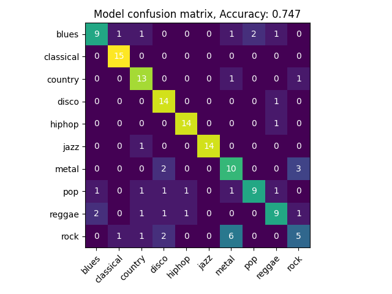

# Music Genre Classification using CNN

Welcome to Music Genre Classification Project using Convolutional Neural Networks (CNN) to classify music tracks into genres.

## Overview

In this work, a CNN model is built and trained on the GTZAN dataset (1000 songs of 30 seconds) to classify songs into predefined genres using Mel-spectrograms or Mel-frequency cepstral coefficients (MFCCs) generated from audio files. This can be useful for music recommendations, organization, and more.

The training of the CNN model is meant to be used on a single CPU. To reduce data usage, features extraction and data transformations are applied on the fly.

## Experiments

The model was trained on 70% of the GTZAN dataset, validated on 15%, and tested on the remaining 15%.

The architecture of the CNN model is flexible, allowing experiment on the number of layers and filters. 
The architecture of the model is inspired by the [MusicRecNet model](https://ietresearch.onlinelibrary.wiley.com/doi/full/10.1049/el.2019.4202).

Various time-frequency transformations can be tested in the feature extraction step. In this case, Mel-spectrograms and MFCCs have been used. 

The model is trained using the Adam optimizer and the categorical cross-entropy loss function. 

## Results

In our case, the Mel-spectrograms representation performs better than MFCCs, achieving an accuracy of 74.7% on the test set. 
The confusion matrix of the best model is shown below:

The best model's configuration can be found in the `config` directory.

## Installation

Clone this repository:
`
git clone https://github.com/QKTheoNguyen/Music_Classification_Project.git
`

Install the required packages:
`
pip install -r requirements.txt
`

## Usage

1. Download the Dataset: First Download the [GTZAN Dataset](https://www.kaggle.com/datasets/andradaolteanu/gtzan-dataset-music-genre-classification)
1. Prepare the Dataset: Ensure your dataset of audio files is organized by genre in the "data" folder
2. Train the Model: Execute the `main.py` script to train the CNN
3. Evaluate the Model: Use the evaluation script `evaluate.py` to test the model’s accuracy
